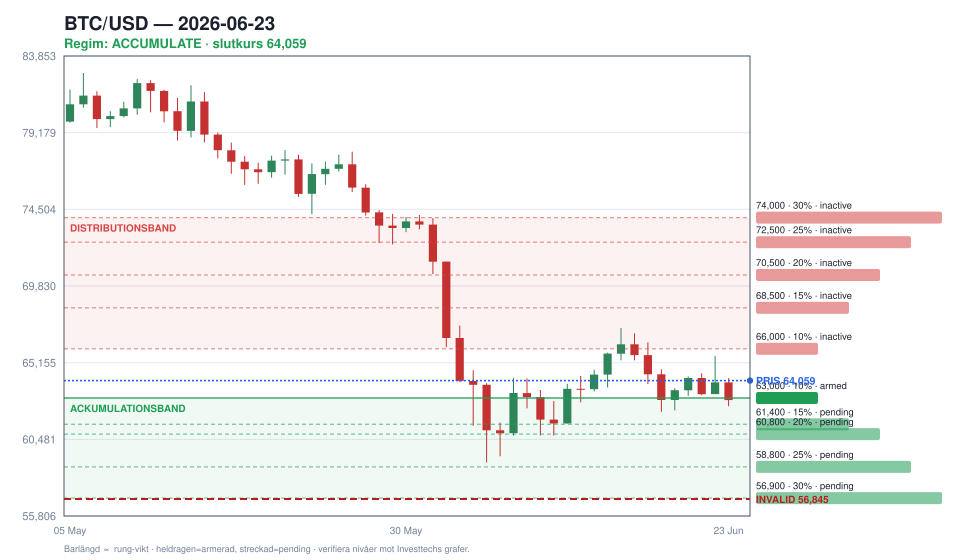

# BTC Investtech-digest — 2026-06-23



## Bottom line

**Status: STARTER (rung 1, 10 %) — försiktig, konfidens LÅG. Regim ACKUMULERA.** Korsverifieringen ändrar bilden mot gårdagens läsning: på din handelsvenue (Coinbase **62 397**) handlas BTC **redan inne i** 63 000-bandet, ~0,28 ATR under rung 1 — inte ovanför som Investtechs feed (**64 059**) antyder. Gapet Investtech−venue är **+1 662** (Investtech ligger högre). Per fadermodellen är detta startläge: djup-negativ lång score (**−90**) + pris i strukturellt stödband → första nibble armerad. Men feed-divergensen + alla rek på sälj-sidan håller konfidensen **låg** — verifiera på din egen graf innan du fyller. Hård linje: bekräftad dagsstängning under **56 845** dödar caset.

> `Rapporterat`: scores/rek/nivåer från Investtech. `Korsverifierat`: venue-pris + ATR från `venue_crosscheck.py`. `Härlett`: zoner/stege. `Mitt beslut`: handelsplanen nedan.

## Handelsplan (`Mitt beslut`)

| Fält | Värde |
|------|-------|
| **Status** | 🟡 **starter** (endast rung 1) |
| Entrytrigger | Venue-pris redan i 63 000-bandet (Coinbase 62 397, −0,28 ATR) |
| Stop / invalidering | **56 845** (bekräftad dagsstängning under) |
| Första mål | 66 000 (kortsiktigt motstånd / distributionsstart) |
| Max-allokering nu | **10 %** (rung 1-tak — överskrid inte) |
| Reward/risk | ~0,65 (mål +3 600 / risk −5 550 från venue-pris) |
| Konfidens | **låg** — Investtech-feed 1 662 över venue, rek alla sälj-sidan |

R/R under 1 säger: detta är en *tidig fader-start*, inte ett högkvalitativt köp. Storleken (10 %) är skyddet. Tyngre rungs lägre i bandet ger bättre R/R.

## Regim & köpstege (`Härlett`)

**Regim: ACKUMULERA.** Lång score −90 (slope 0 = planat), medel −40. Venue-pris i bandtoppen. Rung `armed` sätts från **venue**-avstånd (inom 1 ATR), inte Investtechs close.

| Rung | Pris | Vikt | Venue-avstånd | Status |
|------|------|------|---------------|--------|
| 1 | **63 000** | 10 % | −0,28 ATR (i band) | 🟢 **armerad / triggad på venue** |
| 2 | 61 400 | 15 % | +0,47 ATR | ⏳ pending |
| 3 | 60 800 | 20 % | +0,75 ATR | ⏳ pending |
| 4 | 58 800 | 25 % | +1,68 ATR | ⏳ pending |
| 5 | **56 900** | 30 % | +2,57 ATR | ⏳ pending (tyngst, vid invalidering) |

🚫 **Invalidering: bekräftat brott under 56 845** → voida resterande rungs. Bottenrungen sitter på linjen; rung-vikterna är hårt tak.

**Distributionsstege (inaktiv):** 66 000 / 68 500 / 70 500 / 72 500 / 74 000, bakvägd.

## Korsverifiering (`Korsverifierat` — venue/ATR)

| Mått | Värde |
|------|-------|
| Venue spot (Coinbase BTC-USD) | **62 397** |
| Binance BTCUSDT | ej tillgänglig (HTTP 451 region) |
| Investtech close − venue | **+1 662** ⚠️ stort gap |
| ATR(14) dygn | 2 135 (3,42 %) |
| Fallande kniv? | **Nej** — venue över invalidering, ingen dagsstängning under band­stöd, kort score accelererar inte ned (slope +6) |

⚠️ **Tolkning:** Investtechs feed släpar/avviker ~1 662 mot Coinbase. Litar du på venue är rung 1 redan i spel; litar du på Investtech väntar du på 63 000. Det är därför konfidensen är låg — bekräfta på din egen graf (eller TradingView MCP lokalt) före fill.

## Momentum i modellen (score-slopes)

| Tidsram | Score | Slope (Δ vs igår) |
|---------|-------|-------------------|
| Lång | −90 | **0** (planat, slutade falla) |
| Medel | −40 | −1 |
| Total | −77 | **+1** |
| Kort | −48 | **+6** |

**Nyckelsignalen:** lång sikt slutade bli mer negativ och kort/total tickar upp — första tunna tecknet på att nedsidan tappar fart. Men −90 är ett golv, så det är svagare bevis än en faktisk uppgång därifrån.

## Summering — alla fyra tidsramar (`Rapporterat`)

| Tidsram | Rek | Score | Δ score |
|---------|-----|-------|---------|
| Lång sikt | **Sälj** | −90 | 0 |
| Medellång | **Svag sälj** | −40 | −1 |
| Totalanalys | **Sälj** | −77 | +1 |
| Kort sikt | Svag sälj *(↑ från Sälj)* | −48 | +6 |

*Kort sikt = fill-timing. Brottet upp genom kanaltaket är en timing-nudge, inte en entrygate.*

## Nivåöversikt

```
  Motstånd   74 000   ← brutet stöd → distributionsrung 5
  Motstånd   66 000   ← första mål / distributionsstart
─────────────────────────────────────────────
  Investtech 64 059   ← feed-pris (ovanför band)
  63 000   Rung 1  🟢 armerad (bandtopp)
  VENUE      62 397   ← Coinbase, REDAN I BANDET
  61 400   Rung 2
  60 800   Rung 3  (kortsiktigt stöd)
  58 800   Rung 4
  56 900   Rung 5  (tyngst)
  56 845   🚫 INVALIDERING — sluta addera
```

## Varningsmönster & falsifierbarhet

- ⚠️ **Möjlig huvud-skuldra** kvarstår på lång sikt — nackbrott under 56 845 förstärker nedsidan.
- ⚠️ **Brutet stöd ~74 000** är distributionsmål på en återhämtning.
- ℹ️ Negativ volymbalans på lång och kort sikt dämpar styrkan i kortsiktsbrottet.
- 🔬 **Detta case är fel om:** bekräftad dagsstängning under 56 845, eller om lång score börjar falla igen (−90 → mer negativt är omöjligt, men ny lägre rek-struktur över tidsramar) medan kort sikt vänder ned igen.
- 🔬 **Utfallsgranskning:** baslinjen var igår (2026-06-22); ingen 1/3/7-dagars utfallshistorik ännu — byggs upp framåt.

## Källintegritet (`Rapporterat` provenance)

- Hämtad: **2026-06-23 20:33 UTC**, alla fyra sidor kompletta.
- Feed: Investtech BTCUSDT, CompanyID 99400001 (product 5/4/6/211).
- Citat (invalidering): *"Etablerat genombrott under stödet vid 56845 ... signalerar om fortsatt nedgång."*
- Citat (kort sikt): *"Bitcoin har brutit upp genom taket i en fallande trendkanal på kort sikt."*

---

> ⚠️ Nivåer och rung-priser är härledda ur Investtechs text och bör verifieras mot Investtechs grafer (och din egen venue-graf) innan handel. Denna digest är ett besluts­stöd, inte en auto-trader.
