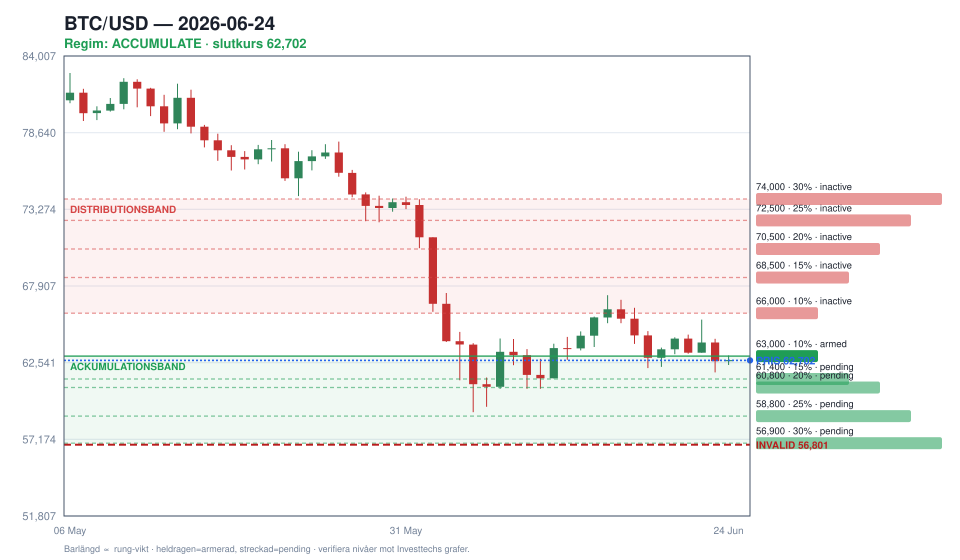

# BTC Investtech-digest — 2026-06-24



## Bottom line

**Regim: ACKUMULERA. Rung 1 är armerad NU — kursen har brutit 63 000 och tryckt in i köpzonen. Lägg första nibblet (10 %).** Kursen **62 702** (−1 357, −2,12 %) bröt medellångt stöd vid 63 000 och är nu inne i bandet 63 000 → 56 900. Samtidigt **lättade långsiktig score kraftigt: −90 → −52** — det är precis fadeaarens tidiga tell (nedsidan slutar accelerera) och den stärker köpcaset. Medellång score föll däremot hårt (−39 → −87), så vi fångar delvis en fallande kniv — därför stege och tak, inte all-in. Hård linje: bekräftat brott under **56 801** (huvud-skuldra-nacken) dödar caset.

## Regim & köpstege (huvudfokus)

**Regim: ACKUMULERA (oförändrad).** Kursen är nu inne i den strukturella stödzonen och långsiktig pessimism exhausteras (−90 → −52). Det är dubbel bekräftelse för en fadeare: pris in i zon **och** lång score-deceleration. Vi skalar in mekaniskt och låter stegen + invalideringen bära risken.

**Köpstege — band 63 000 → 56 900, bakvägd (mer storlek lägre):**

| Rung | Pris | Vikt | Status | Not |
|------|------|------|--------|-----|
| 1 | **63 000** | 10 % | 🟢 **armerad** | Brutet medellångt stöd — kursen är här nu, första nibble fyr |
| 2 | 61 400 | 15 % | ⏳ pending | Mellan stöden |
| 3 | **60 800** | 20 % | ⏳ pending | Kortsiktigt strukturellt stöd |
| 4 | 58 800 | 25 % | ⏳ pending | Mot kritiska zonen |
| 5 | **56 900** | 30 % | ⏳ pending | Tyngsta köpet, precis ovan invalidering |

🚫 **Invalidering: bekräftat brott under 56 801** (huvud-skuldra-nacken, på ökande volym) → voida resterande rungs, sluta addera, omvärdera. Nästa strukturella stöd därunder ligger nu på **~53 000** (långsiktigt stöd repris­at ned från ~56 900) — det är ett *nedsidemål om invalideringen utlöses*, inte en köprung.

**Distributionsstege (inaktiv idag, mot styrka):** band 66 000 → 74 000, bakvägd (mer storlek högre): 66 000 / 68 500 / 70 500 / 72 500 / 74 000. Fyr mekaniskt och symmetriskt när vi vänder till positiv regim — även när det känns för tidigt.

## Momentum i modellen (score-slopes)

| Tidsram | Score | Slope (Δ vs 22 jun) |
|---------|-------|---------------------|
| Lång | −52 | **+38** 🟢 |
| Medel | −87 | **−48** 🔴 |
| Total | −80 | −2 |
| Kort | −53 | +1 |

**Nyckelsignalen:** långsiktig slope är kraftigt positiv (−90 → −52) — det tidiga tecknet på att nedsidan exhausteras, exakt den lever vi lutar oss in i utan att vänta på att kort sikt vänder Köp. **Varning:** medellång score rasade (−39 → −87) och total är marginellt sämre (−80), så det är ingen ren vändning — det är ett tidigt, motvalls-köp. Båda rörelserna är ovanligt stora för två dagar; verifiera mot graferna.

## Summering — alla fyra tidsramar

| Tidsram | Rek | Score | Δ rek |
|---------|-----|-------|-------|
| Lång sikt | **Sälj** | −52 | = (score lättat) |
| Medellång | **Sälj** | −87 | Svag sälj → **Sälj** |
| Totalanalys | **Sälj** | −80 | = |
| Kort sikt | Sälj | −53 | = |

*Kort sikt (−53) = endast fill-timing. För din horisont är det brus, inte signal.*

## Nivåöversikt

```
  Motstånd   74 000   ← långsiktigt motstånd / distributionsrung 5
  Motstånd   66 000   ← distributionsstege startar här
  Motstånd   63 000   ← FÄRSKT BRUTET stöd, nu motstånd
─────────────────────────────────────────────
  PRIS       62 702   ← inne i köpzonen
─────────────────────────────────────────────
  63 000   Rung 1  🟢 armerad (kursen precis under)
  61 400   Rung 2
  60 800   Rung 3  (kortsiktigt stöd)
  58 800   Rung 4
  56 900   Rung 5  (tyngst)
  56 801   🚫 INVALIDERING — huvud-skuldra-nacken, sluta addera
  53 000   ▼ nedsidemål om invalideringen utlöses (ej köprung)
```

## Varningsmönster

- ⚠️ **Huvud-skuldra på lång sikt** — bekräftat brott under **56 801** på ökande volym signalerar fortsatt nedgång mot ~53 000. Detta är äkta nedsiderisk; därför fadear vi med stege + tak, aldrig all-in.
- ⚠️ **Fallande trendkanal i alla fyra tidsramar** — negativ volymbalans (kort 1v −15,18; medel 1m −42,92) bekräftar säljtryck. Köpen är motvalls; respektera invalideringen.
- ⚠️ **Brutet stöd 63 000** blir nu närmaste motstånd; ett återtag däröver vore första tecknet på att knivfasen mattas.

---

> ⚠️ Nivåer och rung-priser är härledda ur Investtechs text och bör verifieras mot Investtechs grafer innan handel.
